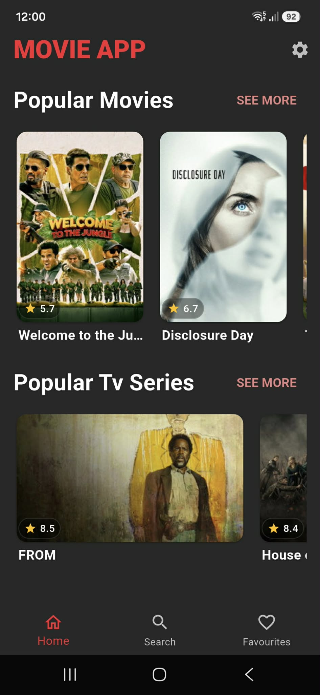
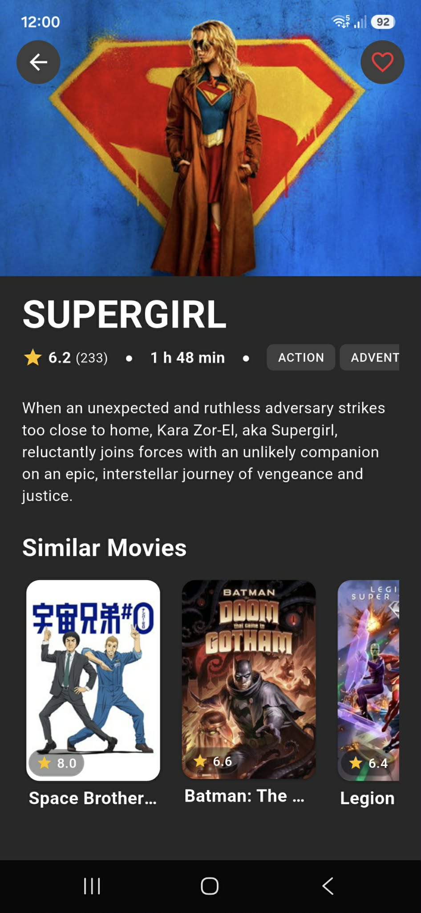
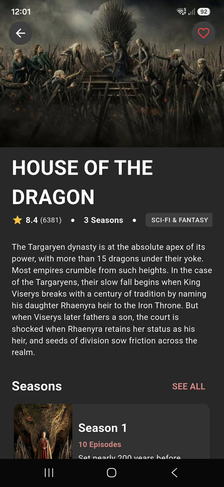
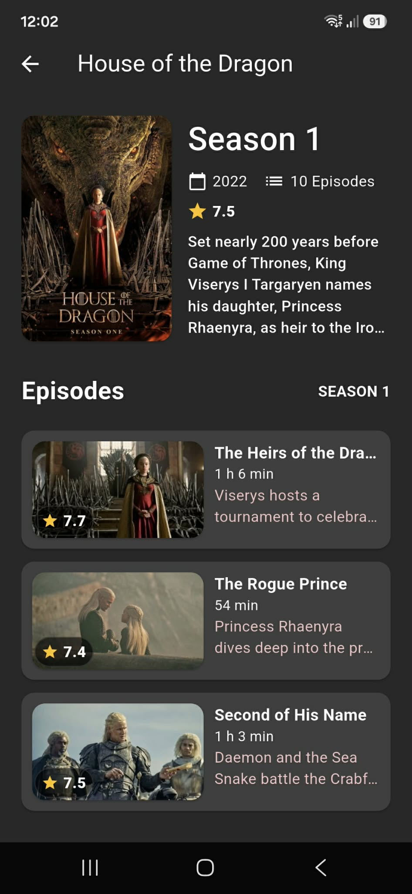

# Movie App

A Flutter app for browsing popular movies and TV shows, built as a learning project to practice clean architecture, BLoC, and dependency injection.

Data provided by [The Movie Database (TMDB)](https://www.themoviedb.org/documentation/api).

## Status
Work in progress. Movies and TV series are fully browsable. Actors, searching and favorites are not implemented yet.

## Screenshots

<p float="left">
  
  
  
  
</p>

## What works

- Home screen with horizontally scrollable previews of popular movies and TV series
- Full popular movies / popular TV series lists with infinite scroll pagination
- Movie details: overview, genres, rating, similar movies
- TV series details: overview, genres, rating, seasons, similar series
- Season details with full episode list

## What's next

- Actors (popular list, details)
- Favorites, stored locally with sqflite, available offline
- Searching movies, TV series, and actors
- Settings (theme, language) via shared_preferences


## Design
 
UI screens were prototyped with [Google Stitch](https://stitch.withgoogle.com/) and then implemented manually in Flutter, adjusting layouts and components along the way.

## Tech Stack

- **State management:** flutter_bloc
- **Architecture:** Clean Architecture (data / domain / presentation layers per feature)
- **Networking:** dio + retrofit
- **DI:** get_it + injectable
- **Code generation:** freezed, json_serializable
- **Navigation:** go_router
- **Local storage:** sqflite (favorites, in progress)

## Getting Started

1. Clone the repo
2. Run `flutter pub get`
3. Create a `.env` file (or change `.env.example` file) in the project root with your TMDB API read access token:
   ```
   TMDB_BEARER_TOKEN=your_token_here
   ```
4. Run `dart run build_runner build` to generate code

## Why this project

This app was built as a practise project while preparing for a Flutter internship. Mostly to learn clean architecture, BLoC, dependency injection, and code generation in Flutter.